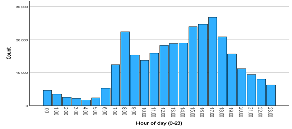

# Road-Accidents-Team-Project-UWE

Team Members
------------
Alex Bashford, Sam Nganga and Hussein Toppozada

Road Accident Analysis & Prediction (UWE Team Project)
------------------------------------------------------

This project explores road accident data in the UK to understand the factors that influence accident severity and to build a model that can predict how serious an accident is likely to be.

The aim of the project was to combine data analysis, statistical testing, and machine learning to identify patterns in accidents and provide insights that could support road safety improvements.

What Was Done
-------------
Analysed a real-world road accident dataset using SPSS and Python

Explored trends across:

-Time (hour of day, monthly patterns)

-Environmental conditions (weather, lighting, road surface)

-Vehicle types involved

-Investigated relationships using cross-tabulation and hypothesis testing

-Built a Decision Tree (CRT model) to predict accident severity

Key Findings
------------

-Accident frequency follows a clear daily pattern, with peaks during morning and evening rush hours

-Most serious accidents occur in fine weather, likely due to higher traffic volume

-After addressing class imbalance, the final model achieved:
~61% accuracy

-Better performance predicting serious accidents (≈64.6%) than slight ones

Example Outputs
---------------

Shows clear peaks during commuting times, highlighting the impact of traffic volume.

Modelling Approach
------------------
A CRT decision tree was used after initial models struggled with class imbalance and predicted only the majority class.

To improve performance:

-Balanced the dataset

-Variables were cleaned and grouped where needed

-The model was re-trained and evaluated on test data

The final model showed consistent performance between training and test sets, suggesting good generalisation.

Skills Demonstrated
-------------------
-Exploratory Data Analysis (EDA)

-Data cleaning & preprocessing

-Statistical analysis (Chi-square, cross-tabulation)

-Machine learning (Decision Trees - CRT)

-Handling class imbalance

-Data visualisation

-Git collaboration

Tools Used
----------

SPSS – data cleaning, EDA, statistical tests, decision trees

Python – supplementary analysis

GitLab / GitHub – version control and collaboration

Repository Structure
--------------------

Data/ – raw and processed datasets

Documentation/ – notes, planning, and project write-up

images/ – graphs and model outputs

README.md – project overview

Purpose of This Project
-----------------------
This project was completed as part of a first-year Data Science module at UWE Bristol. It demonstrates practical skills in analysing real-world data, building predictive models, and working collaboratively in a team environment.
